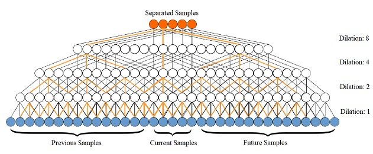
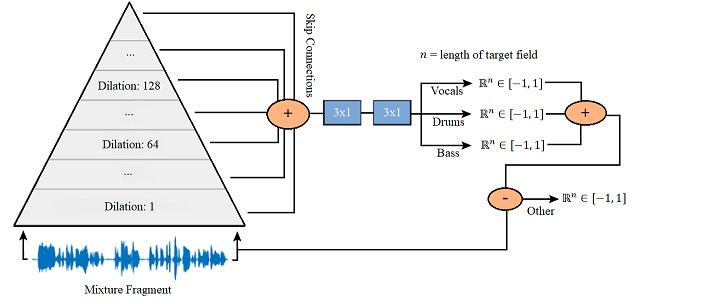

A Wavenet for Music Source Separation
====

A neural network for end-to-end music source separation, as described in [End-to-end music source separation:
is it possible in the waveform domain?](https://arxiv.org/abs/1810.12187)

Listen to separated samples [here](http://jordipons.me/apps/end-to-end-music-source-separation/)

What is a Wavenet for Music Source Separation?
-----

The Wavenet for Music Source Separation is a fully convolutional neural network that directly operates on the raw audio waveform.

It is an adaptation of [Wavenet](https://deepmind.com/blog/wavenet-generative-model-raw-audio/) that turns the original causal model (that is generative and slow), into a non-causal model (that is discriminative and parallelizable). This idea was originally proposed by [Rethage et al.](https://arxiv.org/abs/1706.07162) for speech denoising and now it is adapted for monaural music source separation. Their [code](https://github.com/drethage/speech-denoising-wavenet) is reused.

The main difference between the original Wavenet and the non-causal adaptation used, is that some samples from the future can be used to predict the present one. As a result of removing the autoregressive causal nature of the original Wavenet, this fully convolutional model is now able to predict a target field instead of one sample at a time – due to this parallelization, it is possible to run the model in real-time on a GPU.

See the diagram below for a summary of the network architecture.

Installation
-----
1. `git clone https://github.com/francesclluis/source-separation-wavenet.git`
2. Install [conda](https://conda.io/docs/user-guide/install/index.html)
3. `conda env create -f environment.yml`
4. `source activate sswavenet`

*Currently the project requires **Keras 2.1** and **Theano 1.0.1**, the large dilations present in the architecture are not supported by the current version of Tensorflow*

Usage
-----

A pre-trained multi-instrument model (best-performing model described in the paper) can be found in `sessions/multi-instrument/checkpoints` and is ready to be used out-of-the-box. The parameterization of this model is specified in `sessions/multi-instrument/config.json`

A pre-trained singing-voice model (best-performing model described in the paper) can be found in `sessions/singing-voice/checkpoints` and is ready to be used out-of-the-box. The parameterization of this model is specified in `sessions/singing-voice/config.json`

*Download the dataset as described [below](https://github.com/francesclluis/source-separation-wavenet#dataset)*

#### Source Separation:

Example (multi-instrument): `THEANO_FLAGS=device=cuda python main.py --mode inference --config sessions/multi-instrument/config.json --mixture_input_path audio/`

Example (singing-voice): `THEANO_FLAGS=device=cuda python main.py --mode inference --config sessions/singing-voice/config.json --mixture_input_path audio/`

###### Speedup
To achieve faster source separation, one can increase the target-field length by use of the optional `--target_field_length` argument. This defines the amount of samples that are separated in a single forward propagation, saving redundant calculations. In the following example, it is increased 10x that of when the model was trained, the batch_size is reduced to 4.

Faster Example: `THEANO_FLAGS=device=cuda python main.py --mode inference --target_field_length 16001 --batch_size 4 --config sessions/multi-instrument/config.json --mixture_input_path audio/`

#### Training:

Example (multi-instrument): `THEANO_FLAGS=device=cuda python main.py --mode training --target multi-instrument --config config_multi_instrument.json`

Example (singing-voice): `THEANO_FLAGS=device=cuda python main.py --mode training --target singing-voice --config config_singing_voice.json`

#### Configuration
A detailed description of all configurable parameters can be found in [config.md](https://github.com/francesclluis/source-separation-wavenet/blob/master/config.md)

#### Optional command-line arguments:
Argument | Valid Inputs | Default | Description
-------- | ---- | ---------- | -----
mode | [training, inference] | training |
target | [multi-instrument, singing-voice] | multi-instrument | Target of the model to train
config | string | config.json | Path to JSON-formatted config file
print_model_summary | bool | False | Prints verbose summary of the model
load_checkpoint | string | None | Path to hdf5 file containing a snapshot of model weights

#### Additional arguments during source separation:
Argument | Valid Inputs | Default | Description
-------- | ------------ | ------- | -----------
one_shot | bool | False | Separates each audio file in a single forward propagation
target_field_length | int | as defined in config.json | Overrides parameter in config.json for separating with different target-field lengths than used in training
batch_size | int | as defined in config.json | # of samples per batch

Dataset
-----

The MUSDB18 is used for training the model. It is provided by the Community-Based Signal Separation Evaluation Campaign (SISEC). 

1. [Download here](https://sigsep.github.io/datasets/musdb.html#download)
2. Decode dataset to WAV format as explained [here](https://github.com/sigsep/sigsep-mus-io)
3. Extract to `data/MUSDB`
